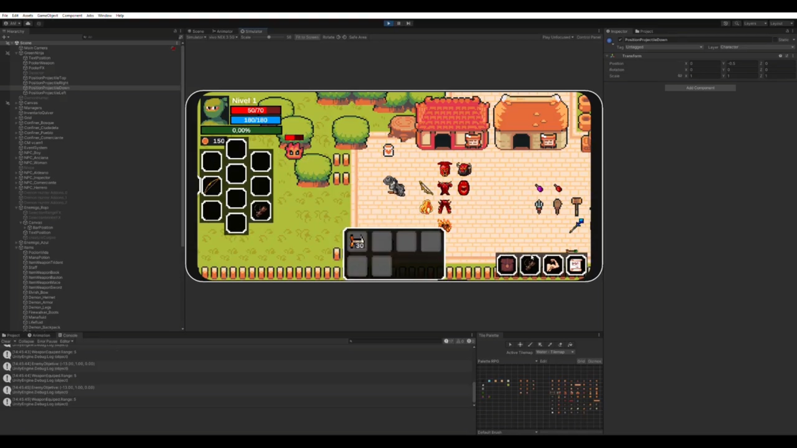
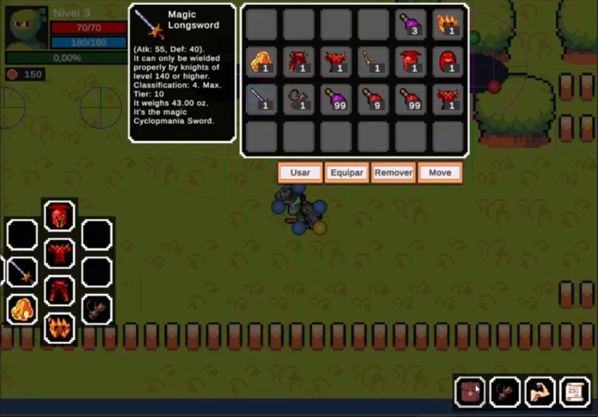
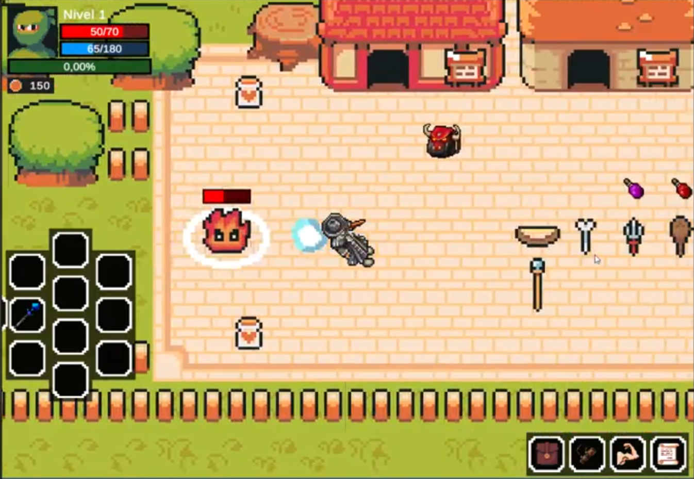
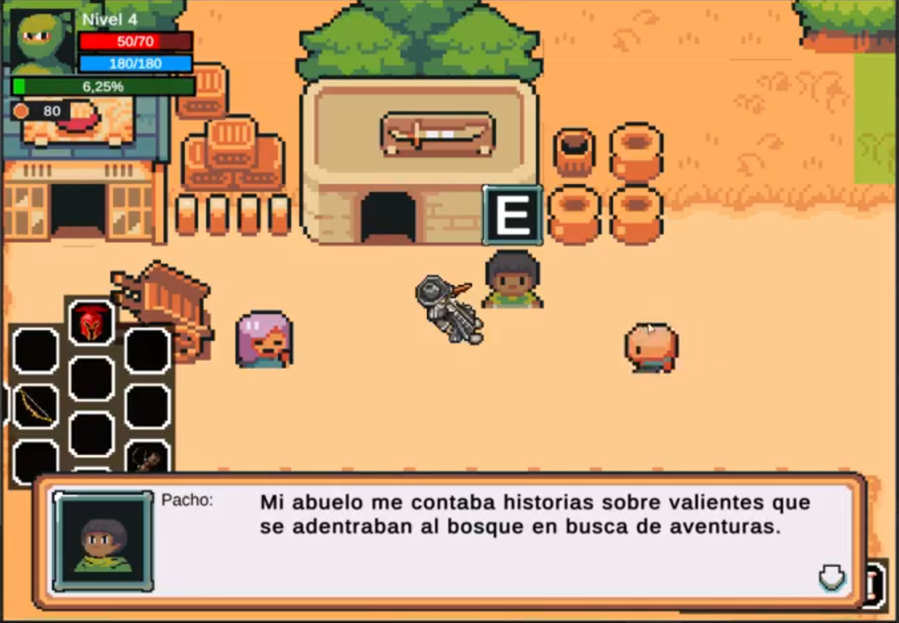
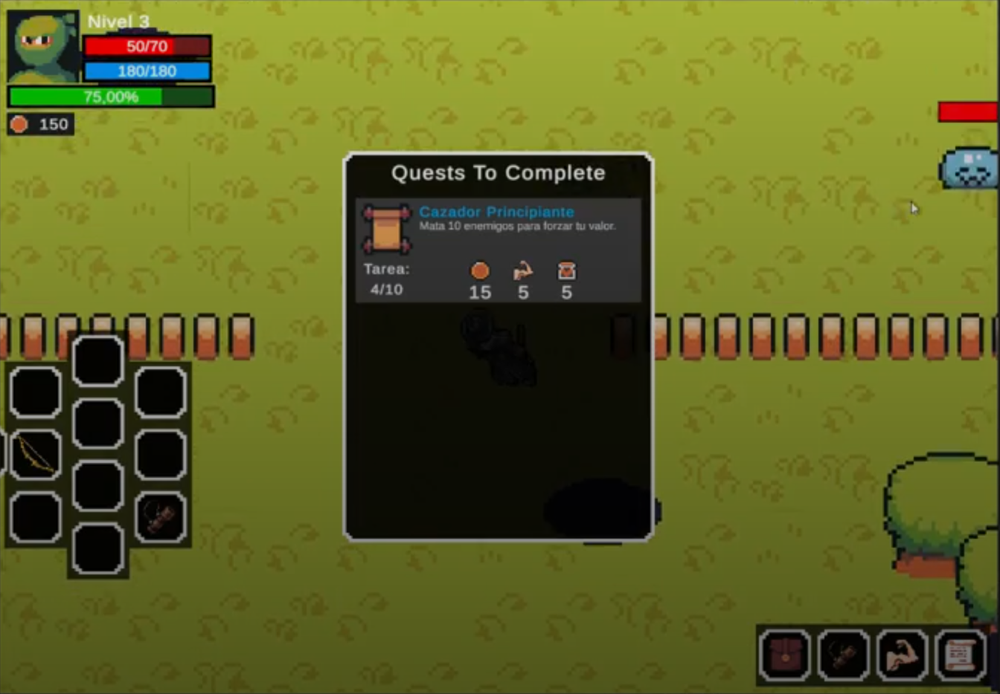
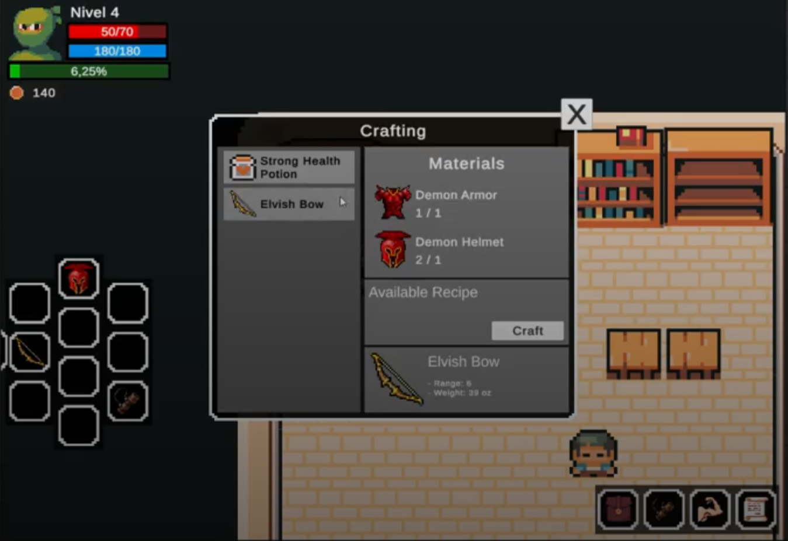
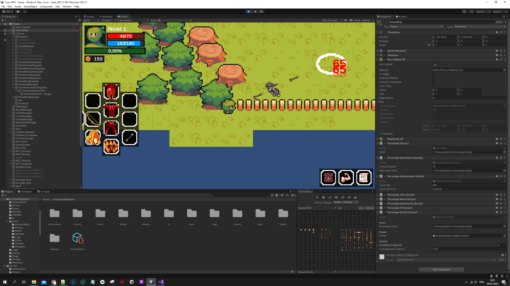
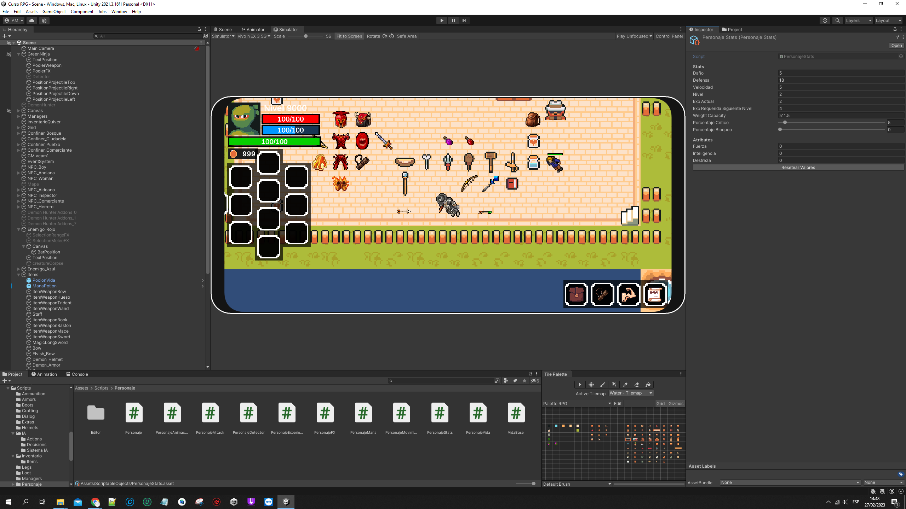
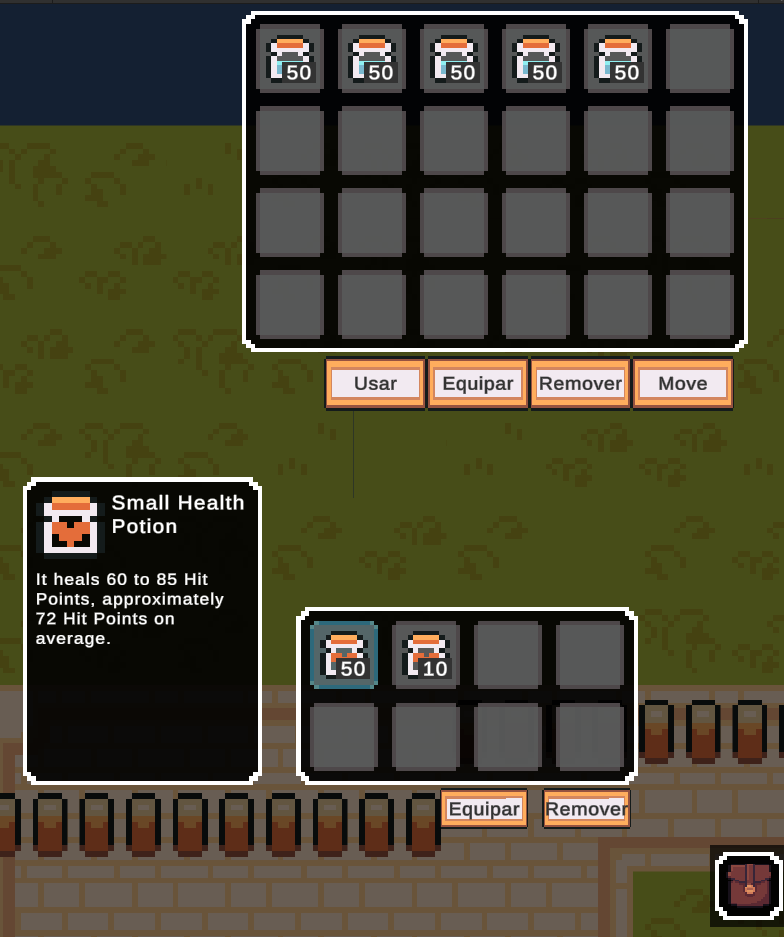

# 🎮 Desarrollo de Videojuego 2D

    

Este proyecto es una demostración de mi aprendizaje en el desarrollo de videojuegos 2D utilizando Unity y C#. Personalicé un videojuego tipo RPG descargando sprites gratuitos de internet con fines educativos. Siguiendo el curso **"Desarrollo de videojuegos en 2D"** de Udemy, logré implementar varias mecánicas y conceptos fundamentales.

## ✨ Características Principales

- **🎨 Diseño del Mundo**: 
  - Uso de `RuleTiles` y `Tilemaps` para la creación automatizada del mapa.
  - Sprites personalizados descargados gratuitamente para representar personajes, enemigos y escenarios.

- **📜 Mecánicas de Juego**: 
  - Movimiento del personaje principal con animaciones suaves.
  - Sistema de **salud**, **maná**, y **atributos** como fuerza y resistencia.
  - Inventario funcional: recoger, mover, equipar y usar objetos.
  - NPC con sistema de **diálogos** y **misiones (Quests)**.
  - **Combate**: lucha contra enemigos con inteligencia artificial.
  - **Loot System**: recolectar objetos tras derrotar enemigos.
  - Tienda para comprar objetos y sistema de crafting para crear ítems.

- **🎥 Dinámica de Cámara**:
  - Movimiento de la cámara implementado con **Cinemachine**.

- **🛠️ Programación Avanzada**:
  - Uso de patrones como **Singleton Pattern** y conceptos de POO como:
    - Herencia
    - Propiedades
    - Clases abstractas
    - Métodos virtuales

## 📚 Avances y Aprendizajes

- **Programación en C#**:
  - Mejora en la comprensión de programación orientada a objetos.
  - Implementación modular y reutilizable del código.
  - Resolución de problemas durante el desarrollo, mejorando habilidades de depuración.

- **Unity**:
  - Uso eficiente de herramientas como `Tilemaps`, `Cinemachine` y `Animator`.
  - Optimización del flujo de trabajo en el editor.

- **Diseño de Videojuegos**:
  - Comprensión de mecánicas clave de los RPG y su implementación.
  - Personalización de elementos del juego para crear un estilo único.

## 🖼️ Capturas de Pantalla

    
    
    
    
    
    
    
    
    

## 🛠️ Tecnologías y Herramientas Utilizadas

- **Motor de juego**: Unity 2022
- **Lenguaje de programación**: C#
- **Sprites**: Recursos gratuitos descargados para uso educativo
- **IDE**: Visual Studio
- **Curso de referencia**: [Desarrollo de videojuegos en 2D con Unity (Udemy)](https://www.udemy.com/course/aprende-a-crear-un-videojuego-rpg-en-2d-con-unity-2021)

## 🚀 Próximos Pasos

- Agregar nuevas mecánicas como habilidades especiales y niveles de dificultad.
- Incorporar un sistema de guardado y carga de partidas.
- Mejorar la inteligencia artificial de los enemigos.
- Optimizar el rendimiento del juego para diferentes dispositivos.

## 🎯 Objetivo del Proyecto

Este proyecto tiene como propósito aplicar conocimientos adquiridos durante el curso y ampliar mis habilidades en el desarrollo de videojuegos, con miras a futuros proyectos más complejos y personalizados.

## 📜 Licencia

Este proyecto es solo para fines educativos. Los sprites y recursos utilizados pertenecen a sus respectivos autores y fueron descargados bajo licencias de uso gratuito.

